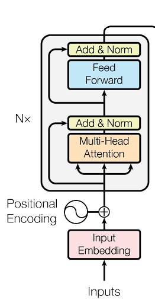
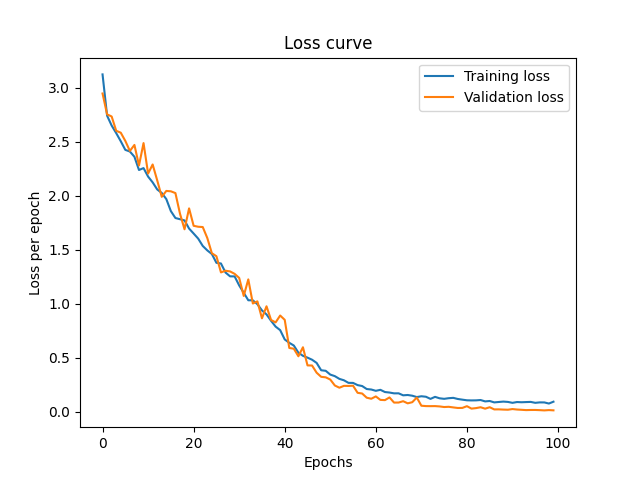

# Transformer Encoder Character Reversal

This project implements a transformer encoder from scratch to reverse word sequences. This simple task is taken as an 
example to show whether the implementation of the encoder works or not.

# Architecture

The model follows the encoder architecture from "Attention is all you need" - (Vaswani et al.)
It uses:
- A single multi-head self-attention layer
- Feedforward sublayer
- Residual connections and Layer Normalization

  

# How to run

Install dependencies using

pip install torch matplotlib 

# or

pip install -r requirements.txt

You can also customize your encoder and dataset in train_encoder.py

# Model Inference and loss curve

The encoder learns from the 500 samples that are created randomly and learns to reverse characters for all
sequences less than or equal to the maximum context length. Even if you have only shown padded sequences of 
letters upto context length, during inference it will generalize for all lengths until the maximum
context length. Here is the loss curve for my implementation of this model.

  

# Future Work

I'll implement the decoder as well with simple tasks such as translations and text generation
for verification! Stay tuned!

